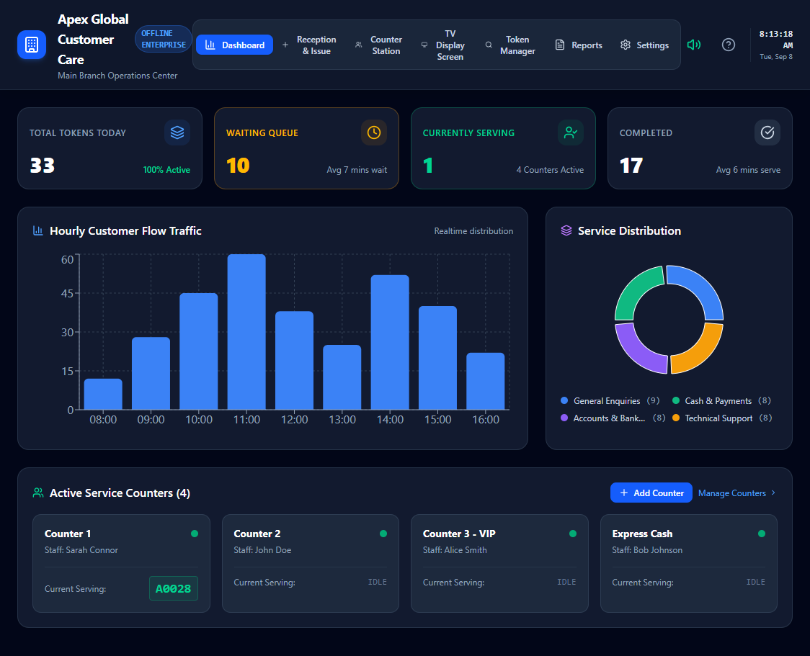

# 🎫 Queue Management System (QMS)

An enterprise-grade, offline-first Queue Management & Smart Token Dispatching System designed for customer care centers, banks, and service points. Built with modern web technologies, this solution streamlined customer flow, service counter operations, ticket printing, and voice announcements.

---

## ✨ Key Features

* **📊 Real-time Executive Dashboard:**
  
  * Real-time metrics: Total tokens, waiting queue, active counter statuses, and completion rates.
  * Hourly Customer Flow Traffic (Bar Chart) & Service Distribution analytics (Donut Chart).
 
* **🎫 Reception & Smart Token Generation:**
  
  * Categorized ticket generation (General Enquiries, Cash & Payments, Accounts & Banking, Technical Support).
  * Priority Ticket Handling (Normal, VIP, Senior Citizen, Pregnant, Disabled, Emergency).
  * Thermal Ticket Print Preview ($58\text{mm} / 80\text{mm}$ printer support) with auto-trigger dialog.

* **💻 Counter Station Interface:**
  * Dedicated operator view with one-click actions: **Call Next (F2)**, **Recall (F3)**, **Complete (F5)**, and **Skip (F4)**.
  * Real-time view of eligible waiting queue per counter assignment.

* **📺 Public TV Display Screen:**
  * Digital signage display showing active ticket calls per counter and upcoming tokens in line.
  * Visual status updates for seamless customer guidance.

* **📋 Token Manager & History Log:**
  * Full audit trail of generated tokens with live status tracking (*Waiting*, *Serving*, *Completed*, *Skipped*).
  * Quick search and status filters.

* **📈 Reports & Performance Analytics:**
  * Operational KPIs including average wait time and average serve time.
  * Counter serving productivity charts.
  * Data export options in **CSV** and full backup in **JSON** formats.

* **⚙️ System & Voice Branding Settings:**
  * Multi-counter management and custom staff/category tagging.
  * Integrated Text-to-Speech (TTS) Voice Announcement Synthesizer with adjustable speech speed.
  * Customizable business identity and ticket header/footer text.

---

## 🛠️ Tech Stack

* **Frontend:** React / Next.js / HTML5, Tailwind CSS
* **Icons & UI Elements:** Lucide Icons, Custom UI Components
* **Charts:** Chart.js / Recharts
* **Printing & Audio:** Native Web Print API & Web Speech API (Voice Synthesis)
* **Data Storage:** LocalStorage / IndexedDB (Offline Enterprise Ready)

---

## 🚀 Getting Started

### Prerequisites

Ensure you have the following installed on your local machine:
* **Node.js** (v16.0 or higher)
* **npm** or **yarn**

### Installation

* Install dependencies:
   npm install

* Run the application locally:
   npm run dev

* Open [http://localhost:3000](http://localhost:5173/) in your web browser.
